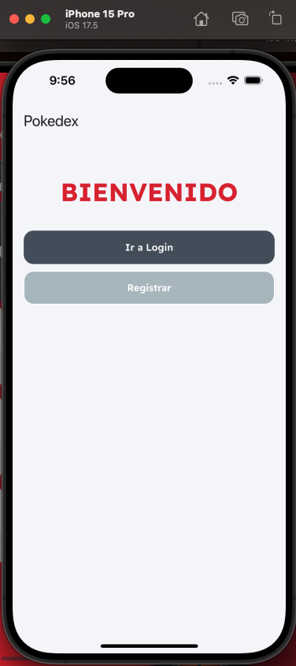
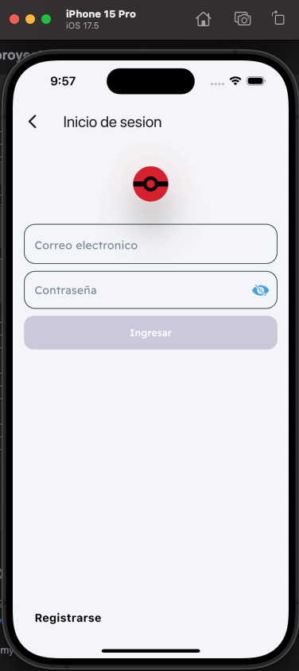
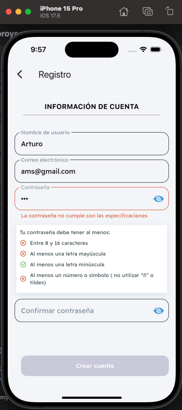
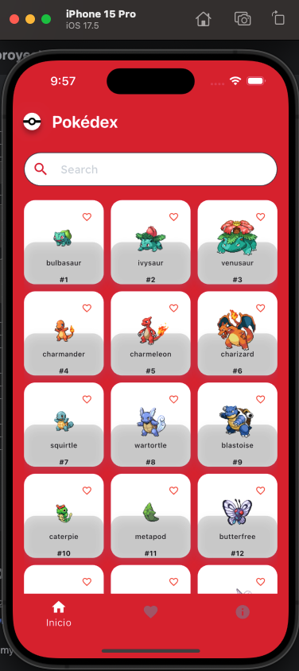
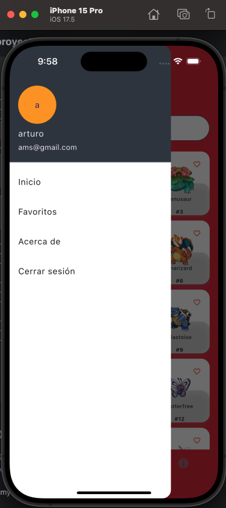
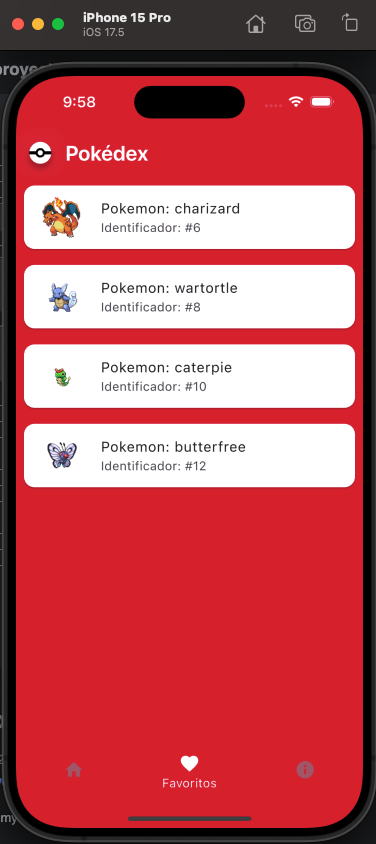
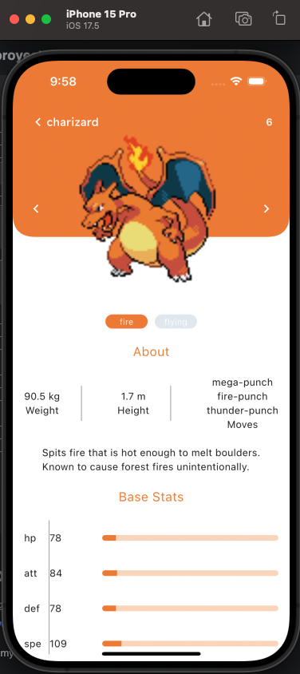
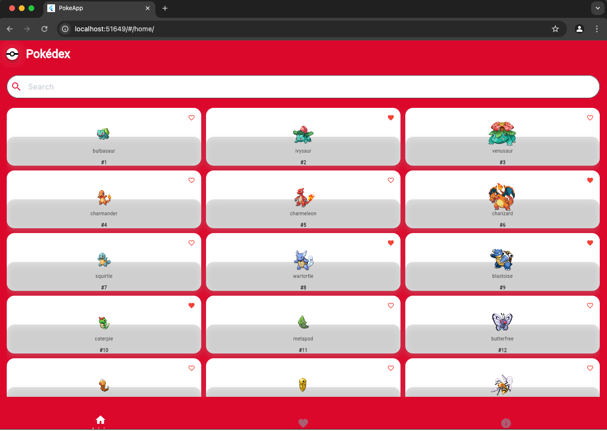
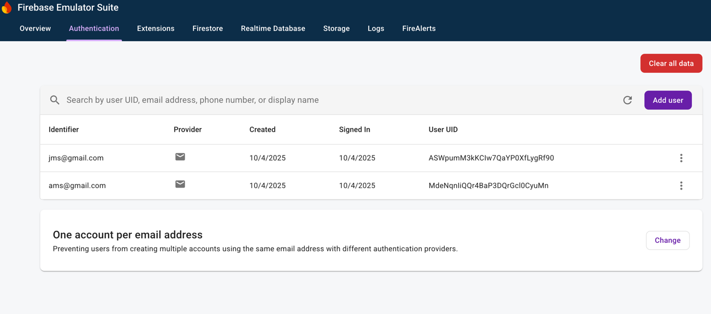
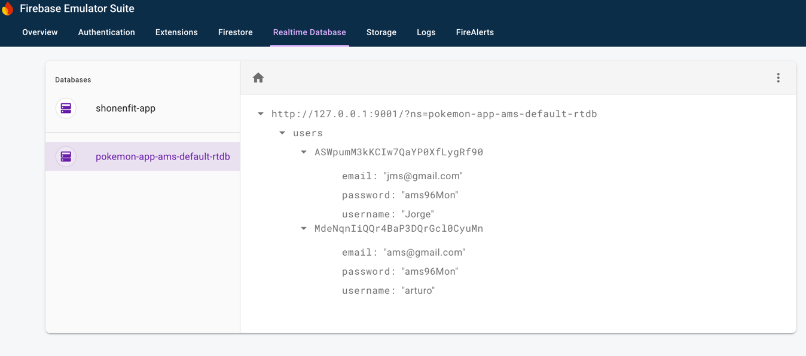

[](https://git.io/typing-svg)


[](https://www.linkedin.com/in/arturo-montiel-salguero-194059126/)
[](https://www.facebook.com/arturo.salguero.94064?mib)

# AMS :. Pokemon App

Aplicación para mostrar el listado de pokemons y sus detalles, esta app se integro con servicios de firebase para la autenticacion, al igual se integro con crashlitycs para monitoreo de errores,
la app cuenta con login y registro, una vez creada la cuenta en el home consume una api gratuita de pokemon y muestra el listado de los datos obtenidos, cuenta con la opicon de ver los detalles de cada pokemon y agregar tus favoritos.


### Demo:









### versión web:


### Probar proyecto:
Ejecutar los siguientes comandos:
```
1.- en raiz del proyecto: flutter pub get
2.- para ios: cd ios
    - pod install
        - en caso de dar error de dependencias:
            - pod repo update
            - pod install
            
3.- Ejecutar el comando Flutter run y seleccionar el dispositivo ó navegador a usar
```


### Estructura del proyecto:

```
lib/
│
├── src/
│   ├── AtomicModel-UI/  -------------------------------- Section to separate the UI
│   │   ├── atoms/       -------------------------------- Basic widgets as Input, Buttons, Labels
│   │   ├── molecules/   -------------------------------- Union between two or more atoms
│   │   ├── organisms/   -------------------------------- Interaction between molecules
│   │   └── utils/       -------------------------------- Utilities such as validations
│   └── App/             -------------------------------- Clean Architecture
│       ├── Core/        -------------------------------- Shared global functionalities
│       │   ├── errors/  -------------------------------- Classes for handling errors and exceptions.
│       │   ├── useCases/ ------------------------------- General use cases, such as a base or abstract use case.
│       │   ├── utils/    ------------------------------- Utility functions such as validations or formatting.
│       │   ├── constants/ ------------------------------ Global constant values (eg. routes, strings, API keys).
│       │   │
│       └── Features/    -------------------------------- different features or modules of the application
│           └── Home/    -------------------------------- this is an example to feature
│               ├── domain/
│               │   ├── entities/ ----------------------- Classes that represent domain entities (fundamental objects in the business). Example: User, Profile
│               │   ├── repositories/ ------------------- Interfaces that define repository contracts. Example: Authentication Repository.
│               │   └── useCases/ ----------------------- Classes that implement the logic of the use cases. Example: Login, Register, GetUserProfile.
│               ├── data/
│               │   ├── models/ ------------------------- Classes that implement data models (typically used to serialize and deserialize data from the API). Example: UserModel.
│               │   ├── datasources/ -------------------- External data sources, such as APIs, databases, etc. Example: RemoteDataSource, LocalDataSource.
│               │   └── repositories/ ------------------- Concrete implementations of the repositories defined in the domain.
│               └── presentation/
│                   ├── widgets/ ------------------------ Reusable UI widgets. Example: buttons, inputs.
│                   ├── pages/ -------------------------- Pages or screens. Example: LoginPage, RegisterPage.
│                   └── cubit/ -------------------------- Here would go the state logic with events and states.
├── test/
├── ios/
├── android/
└── web/
```

## Autenticación

para la autenticación se uso Firebase Autentication usando email y password:


## Base de datos
se utilizo relatime de Firebase:


## Backend
Se consumio una api externa gratuita de pokemon: https://pokeapi.co/api/v2/pokemon/

## 📬 Contacto

- **Email:** ticmontiel200596@gmail.com
- **Website:** https://www.artmontielssolutions.com

Thank you for visiting my GitHub profile! 🚀

## Flutter Documentation

For help getting started with Flutter development, view the
[online documentation](https://docs.flutter.dev/), which offers tutorials,
samples, guidance on mobile development, and a full API reference.

